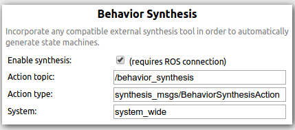

# FlexBE Synthesis Demonstration

Behavioral Synthesis is a powerful process that allows a user to create "correct-by-construction"
behaviors given an initial condition and desired goals.
However, current approaches require extensive knowledge of the system being used.

This release builds upon work from [Maniatopoulos et. al](http://dx.doi.org/10.1109/ICRA.2016.7487613)
and [Hayhurst and Conner](http://dx.doi.org/10.1109/SECON.2018.8479047) to provide a demonstration of synthesis
of executable robot behaviors using [FlexBE](https://github.com/FlexBE)

This version is a preliminary release of a ROS 2 conversion of the prior work of
[Hayhurst and Conner](http://dx.doi.org/10.1109/SECON.2018.8479047).

> Note: The file generation script described in [Hayhurst and Conner](http://dx.doi.org/10.1109/SECON.2018.8479047)
> does not function in this preliminary ROS 2 release.
> The focus of this release is to facilitate the demonstration presented in
> [FlexBE Synthesis Demo](https://github.com/CNURobotics/flexbe_synthesis_demo)
> and the corresponding paper from [Luzier and Conner](https://ieeexplore.ieee.org/search/searchresult.jsp?newsearch=true&queryText=conner%20and%20luzier%20and%20FlexBE).

A complete refactoring of this system, including the full file generation capabilities, is due Fall 2024.
This work will extend the creation of an end-to-end synthesis approach by generating
the system wide capabilities available to the user.
This allows the user to work with behavioral synthesis without prior knowledge of the systems being used.

# Setting Up Synthesis

This demonstration uses custom versions of the FlexBE system that have an additional
tagging standard defined in [Hayhurst and Conner](http://dx.doi.org/10.1109/SECON.2018.8479047);
you must build these customized versions of FlexBE from source at this time.

The following information provided in a `rosinstall` or `vcs tools` format:
```
- git: {local-name: src/flexbe_app,               uri: 'https://github.com/CNURobotics/flexbe_app.git',                version: ros2-pre-release-synthesis }
- git: {local-name: src/flexbe_behavior_engine,   uri: 'https://github.com/CNURobotics/flexbe_behavior_engine.git',    version: ros2-pre-release-synthesis }
- git: {local-name: src/chris_gr1_synthesis_demo, uri: 'https://github.com/CNURobotics/chris_gr1_synthesis_demo.git',  version: alpha }
```

The above branches have been tested on ROS 2 Iron.  
For ROS 2 Humble, use the `humble-synthesis` branches instead of `ros2-pre-release-synthesis`

After cloning and building the packages using `colcon`, and updating the ROS workspace setup variables,
you will need to `ros2 run flexbe_app nwjs_install` before running the FlexBE app.

You must also install the [`Slugs`](https://github.com/VerifiableRobotics/slugs) GR(1) synthesis tool.
Run the bash script `install_slugs.sh` found in the `chris_gr1_synthesis_demo/ltl_synthesizer` folder.
> Note: This requires `sudo` access and installs the `slugs` executable in the `/usr/local/bin` folder .

# FlexBE Configuration

Using behavioral synthesis for system wide applications the following update must made in the FlexBE App configuration tab:



> Note: Restart the FlexBE app after making this change before attempting synthesis.


## Launching FlexBE

Synthesis is controlled via the FlexBE app:

```bash
ros2 launch flexbe_app flexbe_full.launch.py
```
You may instead launch all components in separate terminals:

```bash
clear; ros2 launch flexbe_onboard behavior_onboard.launch.py use_sim_time:=False
clear; ros2 run flexbe_mirror behavior_mirror_sm --ros-args --remap __node:="behavior_mirror" -p use_sim_time:=False
clear; ros2 run flexbe_app run_app --ros-args --remap name:="flexbe_app" -p use_sim_time:=False
clear; ros2 run flexbe_widget be_launcher --ros-args --remap name:="behavior_launcher" -p use_sim_time:=False
```

> Note: You must relaunch the flexbe_app after making the configuration change shown above;
> subsequent starts should preserve the configuration information.

## Launching Behavioral Synthesis

A launch file for the entire behavioral synthesis set up is located in `synthesis_manager/launch/behavior_synthesis.launch.py`.
This file will run all necessary components for the behavioral synthesis demo.

```bash
ros2 launch synthesis_manager behavior_synthesis.launch.py
```

Or, you may launch each node in a separate terminal:

```bash
clear; ros2 launch synthesis_manager ltl_synthesizer.launch.py
clear; ros2 launch synthesis_manager ltl_compilation.launch.py
clear; ros2 launch synthesis_manager sm_generation.launch.py
clear; ros2 launch synthesis_manager synthesis_server.launch.py
```


Configure the Behavior Synthesis as shown above, and set the default package for Code Generation.

You will need to specify a behavior name, description, and author on the behavior dashboard in order to save and run the synthesized automaton.

See [FlexBE Synthesis Demo](https://github.com/CNURobotics/flexbe_synthesis_demo) for a step-by-step demonstration of synthesis
using these tools.


## Debugging

- Check if the `sm_generation` configuration was successfuly generated, and that the output mappings are followed by a `_c` and a `_f` suffix with ReSpeC version 0.1.0
    - If multiple output mapping suffixes are in the system wide configuration make sure that all behavior and state implementations are using the new tagging standard.
    - If a FlexBE package does not have the new tagging standard and no version of them exists consider removing them for FlexBE exportation when using system wide behavioral synthesis
- Behaviors also need to follow the new tagging standard, this includes automatically generated behaviors produced by FlexBE
    - The current version of the FlexBE App does NOT support adding these tags


## Publications

Please use the following publications for reference when using this synthesis demonstration:

- Josh Luzier and David C. Conner, ["Solving the Farmers Dilemma with FlexBE using GR(1) Synthesis,"]( https://ieeexplore.ieee.org/search/searchresult.jsp?newsearch=true&queryText=conner%20and%20luzier%20and%20FlexBE ), IEEE SouthEastCon, March 2024, to appear.

This work is based on prior work by:

- J. W. M. Hayhurst and D. C. Conner, ["Towards Capability-Based Synthesis of Executable Robot Behaviors,"](http://dx.doi.org/10.1109/SECON.2018.8479047) IEEE SoutheastCon 2018, St. Petersburg, FL, USA, 2018.

- S. Maniatopoulos, P. Schillinger, V. Pong, D. C. Conner and H. Kress-Gazit, ["Reactive high-level behavior synthesis for an Atlas humanoid robot,"](http://dx.doi.org/10.1109/ICRA.2016.7487613), 2016 IEEE International Conference on Robotics and Automation (ICRA), Stockholm, Sweden, 2016.


Please use the following publications for reference when using FlexBE:

- Joshua Zutell, David C. Conner and Philipp Schillinger, ["ROS 2-Based Flexible Behavior Engine for Flexible Navigation ,"](http://dx.doi.org/10.1109/SoutheastCon48659.2022.9764047), IEEE SouthEastCon, April 2022.

- Philipp Schillinger, Stefan Kohlbrecher, and Oskar von Stryk, ["Human-Robot Collaborative High-Level Control with Application to Rescue Robotics"](http://dx.doi.org/10.1109/ICRA.2016.7487442), IEEE International Conference on Robotics and Automation (ICRA), Stockholm, Sweden, May 2016.
